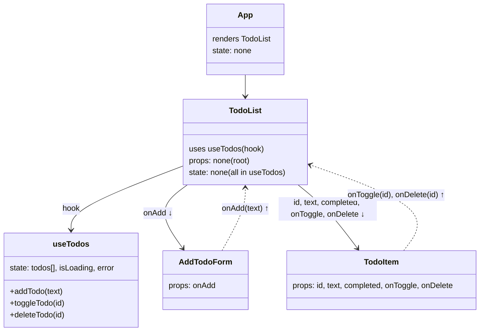

## React Todo List (Vite)

A minimal Todo app built with React and Vite. It loads initial tasks from DummyJSON, supports adding local todos, toggling completion with optimistic updates, and deleting items.

### Tech stack
- **Build tool**: Vite
- **UI**: React 19
- **HTTP**: axios
- **Linting**: ESLint (React hooks + react-refresh plugins)

### Getting started
1. Install dependencies:
```bash
npm install
```
2. Start the dev server:
```bash
npm run dev
```
3. Optional scripts:
```bash
npm run build   # production build
npm run preview # preview built app
npm run lint    # run ESLint
```

### Project structure
```text
src/
  App.jsx
  hooks/
    useTodos.js
  components/
    AddTodoForm/
      AddTodoForm.jsx
      AddTodoForm.css
    TodoItem/
      TodoItem.jsx
      TodoItem.css
    TodoList/
      TodoList.jsx
      TodoList.css
```

### How it works
- `App` renders the root `TodoList`.
- `TodoList` wires UI to the `useTodos` hook, which manages all state and side-effects.
- `useTodos` fetches initial data from DummyJSON and exposes mutate functions. New todos created locally are marked in-memory and not persisted to the API.
- `AddTodoForm` collects input and calls `onAdd(text)`.
- `TodoItem` displays an item with a checkbox and delete button; it calls `onToggle(id)` and `onDelete(id)` as needed.

### State and data flow (Mermaid)


### API behavior
- Base URL: `https://dummyjson.com`
- Endpoints used:
  - `GET /todos?limit=15` — initial load
  - `PUT /todos/:id` — toggle `completed` (optimistic update; reverts on error)
  - `DELETE /todos/:id` — delete item (optimistic; reverts on error)
- Locally added todos are given a timestamp `id` and flagged in-memory; they are not persisted to DummyJSON and are deleted/toggled purely locally.

### Notes
- Loading and error states are surfaced by `useTodos` and rendered by `TodoList`.
- The UI shows an empty state when there are no todos and not loading.


