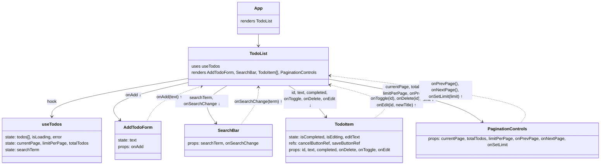

```
### Design Patterns Used:

Custom Hook Pattern;

Container/Presentational Pattern;

Composition Root Pattern;

Props Down, Events Up;

Optimistic Updates;

Controlled Components Pattern;

Memoization Pattern;

Separation of Concerns;

Single Responsibility Principle;

Lifting State Up.

```