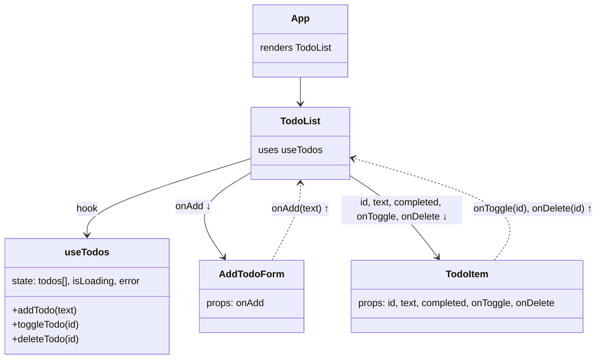

### Project tree

```text
src/
  App.jsx
  hooks/useTodos.js
  components/
    AddTodoForm/AddTodoForm.jsx
    TodoItem/TodoItem.jsx
    TodoList/TodoList.jsx
```

### Component diagram


```mermaid
classDiagram
  class App {
    renders TodoList
  }
  class TodoList {
    uses useTodos
  }
  class useTodos {
    state: todos[], isLoading, error
    +addTodo(text)
    +toggleTodo(id)
    +deleteTodo(id)
  }
  class AddTodoForm {
    props: onAdd
  }
  class TodoItem {
    props: id, text, completed, onToggle, onDelete
  }

  App --> TodoList
  TodoList --> useTodos : hook
  TodoList --> AddTodoForm : onAdd ↓
  TodoList --> TodoItem : id, text, completed, onToggle, onDelete ↓
  AddTodoForm ..> TodoList : onAdd(text) ↑
  TodoItem ..> TodoList : onToggle(id), onDelete(id) ↑
```
